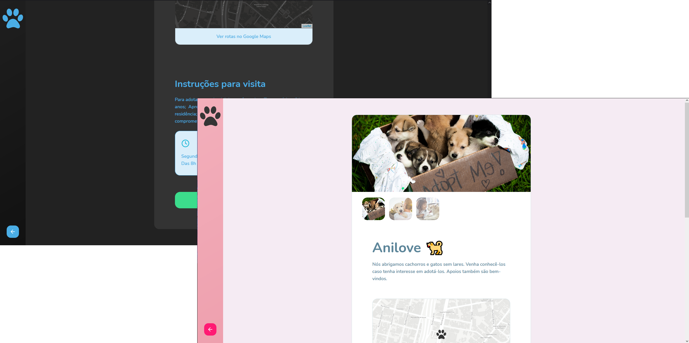
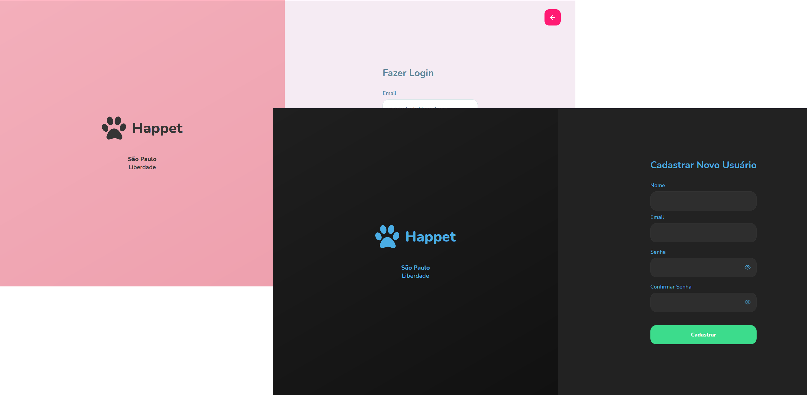
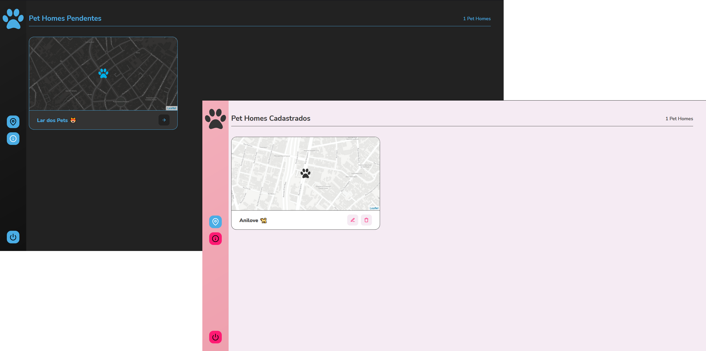

<p align="center">
  

  
  
  <a href="https://github.com/oviniciusoliveira/happet-web/commits/master">
    
  </a>
    
   


  <p align="center">
  <a href="https://app.netlify.com/sites/happet/deploys" target="_blank">
    
  </a>
</p>
</p>

<h1 align="center">
  <a href="https://happet.netlify.app/">
      
  </a>
</h1>

## 📖 Tópicos

<p>
 👉<a href="#-sobre-o-projeto" style="text-decoration: none; "> Sobre o Projeto</a> <br/>
👉<a href="#-funcionalidades" style="text-decoration: none; "> Funcionalidades</a> <br/>
👉<a href="#-layout" style="text-decoration: none"> Layout</a> <br/>
👉<a href="#-como-executar-o-projeto" style="text-decoration: none"> Instalação e Configuração</a> <br/>
👉<a href="#-tecnologias" style="text-decoration: none"> Tecnologias Utilizadas</a> <br/>
👉<a href="#-desenvolvedor" style="text-decoration: none"> Desenvolvedor</a> <br/>
👉<a href="#-licence" style="text-decoration: none"> Licença</a>

</p>

<a name="-sobre-o-projeto"></a>

## 💻 Sobre o projeto

Aplicação que realiza a listagem de Pet Homes (abrigos de animais domésticos) na cidade de Liberdade - SP.

Usuários podem obter informações dos Pet Homes disponíveis, além de poder cadastrar novos Pet Homes no mapa.

Administradores podem aceitar ou rejeitar novos Pet Homes, assim como excluir e editar os já existentes.

O projeto está publicado em: <a align="center" href="https://happet.netlify.app/">

</a>

---

<a name="-funcionalidades"></a>

## ⚙️ Funcionalidades

- [x] Front-end
  - [x] Páginas
    - [x] Sem autenticação
      - [x] Landing Page
      - [x] Mapa indicando os Pet Homes cadastrados
      - [x] Detalhes de um Pet Home
      - [x] Cadastrar novo Pet Home
        - [x] Sucesso ao cadastrar Pet Home
      - [x] Realizar login
      - [x] Cadastrar novo usuário
      - [x] Solitar troca de senha do usuário
        - [x] Envio de email com token para alterar senha
      - [x] Cadastrar nova senha do usuário
    - [x] Com autenticação
      - [x] Listagem de todos os Pet Homes Cadastrados e Aprovados
        - [x] Editar Pet Home
        - [x] Excluir Pet Home
      - [x] Pet Homes pendentes para aprovação
        - [x] Aprovar ou Rejeitar Pet Home
  - [x] Notificações com Toastify;
  - [x] Tema Dark/Light;
  - [x] Animação de loadings utilizando Lottie;
  - [x] Centralizar o mapa com base na geolocalização do usuário (caso permitido)

---

<a name="-layout"></a>

## 🎨 Layout

### Landing Page

<h1 align="center">
    
</h1>

### Página Principal

<h1 align="center">
    
</h1>

### Detalhes de um Pet Home

<h1 align="center">
    
</h1>

### Cadastro

<h1 align="center">
    
</h1>

### Dashboard

<h1 align="center">
    
</h1>

---

<a name="-como-executar-o-projeto"></a>

## 🛠 Instalação e Configuração do Projeto

🛑 Para rodar o Frontend, é necessário que o Backend esteja sendo executado simultâneamente. O repositório do backend pode ser encontrado aqui: **[Happet Backend](https://github.com/oviniciusoliveira/happet-backend)**.

### Pré-requisitos

Para executar os comandos, é necessário possuir as seguintes ferramentas instaladas:
[Git](https://git-scm.com) e [Node.js](https://nodejs.org/en/).

Para manipular o código, recomendo utilizar o [VSCode](https://code.visualstudio.com/).

#### 🎮 Rodando a aplicação web (Frontend)

1. Clone este repositório

   ```sh
   git clone https://github.com/oviniciusoliveira/happet-web.git
   ```

2. Acesse a pasta do projeto no seu terminal/cmd

   ```sh
   cd web
   ```

3. Instale as dependências

   ```sh
   npm install
   ```

4. Altere o nome do arquivo .env.sample para .env e configure as variáveis de ambiente

5. Execute a aplicação em modo de desenvolvimento

   ```sh
   npm start
   ```

6. A aplicação será aberta na porta 3000 - Acesse http://localhost:3000

---

<a name="-tecnologias"></a>

## 🧱 Tecnologias Utilizadas

#### **Website** ([React](https://reactjs.org/) + [TypeScript](https://www.typescriptlang.org/))

#### **Front-end** hospedado na [Netlify](https://www.netlify.com/)

#### **Bibliotecas**

- **[Axios](https://github.com/axios/axios)**
- **[crypto-js](https://www.npmjs.com/package/crypto-js)**
- **[Leaflet](https://leafletjs.com/)**
- **[Polished](https://polished.js.org/)**
- **[React Icons](https://react-icons.github.io/react-icons/)**
- **[React-Leaflet](https://react-leaflet.js.org/)**
- **[React Router Dom](https://github.com/ReactTraining/react-router/tree/master/packages/react-router-dom)**
- **[react-lottie](https://www.npmjs.com/package/react-lottie)**
- **[react-switch](https://www.npmjs.com/package/react-switch)**
- **[react-toastify](https://fkhadra.github.io/react-toastify/introduction)**
- **[Mapbox](https://www.mapbox.com/)**
- **[Styled Components](https://styled-components.com/)**

> Mais informações no [package.json](https://github.com/oviniciusoliveira/happet-web/blob/master/package.json)

#### **Ferramentas e utilitários usados durante o desenvolvimento**

- Editor: **[Visual Studio Code](https://code.visualstudio.com/)**
- Testes de API: **[Insomnia](https://insomnia.rest/)**
- Conteinerização: **[Docker](https://www.docker.com/)**
- SQL Client: **[Beekeeper](https://www.beekeeperstudio.io/)**
- Ícones: **[Feather Icons](https://feathericons.com/)**
- Fontes: **[Nunito](https://fonts.google.com/specimen/Nunito)**

---

<a name="-desenvolvedor"></a>

## 🐱‍👤 **Desenvolvedor**

<p>
 
 <br />
 <sub><strong>⭐Vinícius Oliveira⭐</strong></sub>
</p>

[](https://www.linkedin.com/in/oviniciusoliveira/)

---

<a name="-licence"></a>

## 📝 Licença

Este projeto esta sob a licença [MIT](./LICENSE).

Feito com 💙 por Vinícius Oliveira [👋 Entre em contato!](https://www.linkedin.com/in/oviniciusoliveira/)

---
